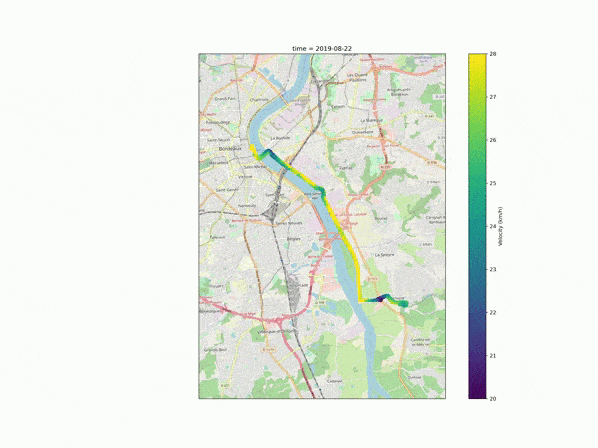

# Velotafmap

A script to draw maps and animations of my daily bike commuting activities,
initially stored with Strava.

The script reads Strava activities gpx files and computes velocity.
The data points are rasterized, daily mean velocity is computed for each pixel,
and results are and stored in an xarray, and can be filtered over time and space.
The output are a map of average velocity over whole timeframe, a map for each daily results,
and an animation based on the daily maps.

## Dependencies

Requires Python 3 with the following packages (listed in environment.yml):

*   xmltodict
*   numpy
*   xarray
*   matplotlib
*   tqdm
*   pandas
*   cartopy
*   scipy
*   opencv
*   pyepsg
*   shapely

## Installation

*   Create the necessary environment using for example `conda env create -f environment.yml`.
*   Create a custom config file named `config/config.ini` based on the example given in `config/example_config.ini`.

## Usage

*   Run the main script `velotafmap/velotafmap.py` using the corresponding environment and the `--input_dir` and `--output_dir` arguments.
